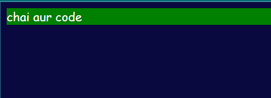

# DOM Manipulation in JavaScript

element traversal, and dynamic element creation.

---

## 1. **DOM Traversal and Manipulation**

### Code Example:
```````html
<div class="parent">
    <div class="day">Monday</div>
    <div class="day">Tuesday</div>
    <div class="day">Wednesday</div>
    <div class="day">Thursday</div>
    <div class="day">Friday</div>
    <div class="day">Saturday</div>
    <div class="day">Sunday</div>
</div>
```````

### Steps Covered:
1. **Selecting Elements**:
   - access elements by class or ID.
   - `const parent = document.querySelector('.parent');`

2. **Accessing Children**:
   - Use `children` to get child elements of a parent.
   - Access specific children using index: `parent.children[1]`.

3. **Styling Elements**:
   - Modify styles dynamically:
     ```javascript
     parent.children[1].style.color = "orange";
     ```

4. **Accessing Sibling and Parent Elements**:
   - `parentElement`: Access the parent node of an element.
   - `nextElementSibling`: Access the next sibling element.


5. **Other Traversals**:
   - `firstElementChild` and `lastElementChild`: Get the first and last child elements of a parent.
``````javascript
    console.log(parent.firstElementChild)
    console.log(parent.lastElementChild)
``````
   - `childNodes`: Returns all child nodes (including text nodes).

``````javascript
    console.log(parent)
    console.log(parent.children)
    console.log(parent.children[1])
    console.log(parent.children[1].innerHTML)
``````

---

## 2. **Creating and Appending Elements**

### Code Example:
```javascript
// Create a new div element
const mydiv = document.createElement('div');

// Set the background color of the div to green
mydiv.style.backgroundColor = "green";

// Assign a class name to the div
mydiv.className = "main";

// Assign a dynamic ID to the div
mydiv.id = Math.round((Math.random() * 10) + 1);

// Set a custom attribute 'title' to the div
mydiv.setAttribute("title", "generated title");

// Create a text node with the content "chai aur code"
const addText = document.createTextNode("chai aur code");

// Append the text node to the div
mydiv.appendChild(addText);

// Append the div to the body of the document
document.body.appendChild(mydiv);
```

### Techniques Covered:
1. **Creating Elements**:
   - `document.createElement('div')`: Dynamically create an HTML element.

2. **Setting Attributes**:
   - Use `setAttribute()` to set custom attributes like `title`.
   - Example: `mydiv.setAttribute("title", "generated title");`

3. **Adding Text to Elements**:
   - Use `document.createTextNode()` for adding text nodes.
   - Append text using `appendChild()`.

4. **Appending Elements to the DOM**:
   - Use `appendChild()` to add elements to the document body or another parent.

5. **Assigning Dynamic IDs**:
   - Example: `mydiv.id = Math.round((Math.random() * 10) + 1);`

---

## 3. **Best Practices and Notes**
- Use `innerText` or `innerHTML` cautiously for better performance and security.
- `createTextNode` is preferred for dynamically adding text.
- Use semantic class names and IDs for better readability.

---

## 4. **Output Preview**
- A green `div` with text "chai aur code" is dynamically generated and added to the page.

