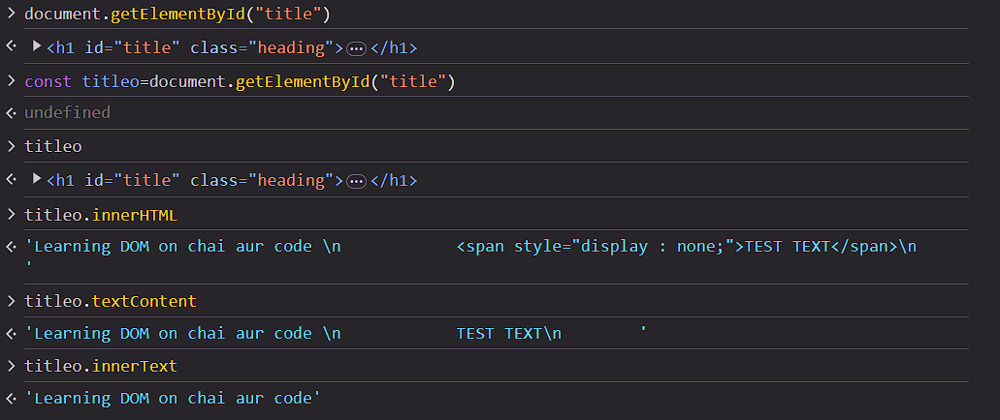
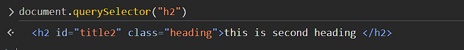
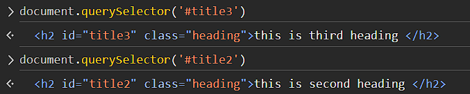
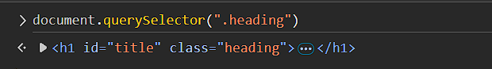
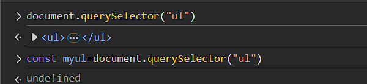
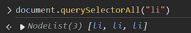
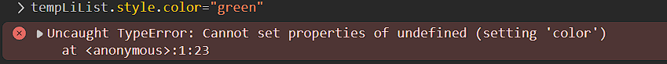

# Learning DOM

### Difference Between All Three Methods
1. **Using `innerHTML`**: Reveals or modifies the HTML content of an element.
   - Example: Revealing hidden text in an HTML code using `<span>`.
   - 
   - **Observation**: Hidden text becomes visible when `innerHTML` is used.

2. **Using `querySelector`**: Fetches the first matching element.
   - Example: In a document with two `<h2>` tags, only the first `<h2>` is selected.
   - 

3. **Using `querySelector` with IDs**: Selects an element by its ID.
   - Example:
     ```javascript
     document.querySelector("#myId")
     ```
   - 

4. **Using `querySelector` with Classes**: Selects an element by its class name.
   - Example:
     ```javascript
     document.querySelector(".myClass")
     ```
   - 

### Fiddling with DOM
- Experimenting further with DOM manipulations:
  - 

---

## Practical DOM Examples

### Selecting and Modifying List Items
 Selecting the first item in a list and changing its background color:
   ```javascript
   const target = myul.querySelector("li")
   target.style.backgroundColor = "green" 
   ```

### querySelectorAll
Selects all queries from the 

```javascript
document.querySelectorAll("li")
````

- note that its type is nodelist its a colllection and therefore doesnt function like arrays

```````javascript
const tempLiList= document.querySelectorAll("li")
```````



 - cant do it coz its not array

```````javascript
tempLiList[0].style.color= "green"
```````
